# TP13 : Évaluation Docker

## Partie 1 — API & Dockerfile

Rendus des routes / et /healthz 

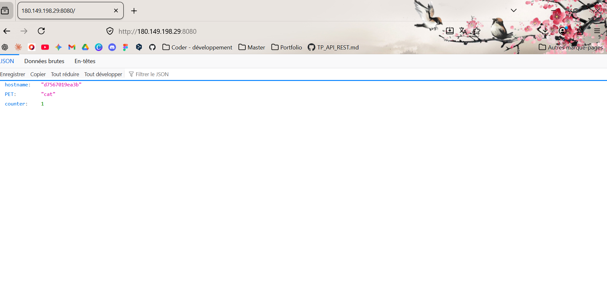
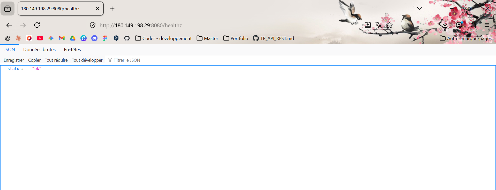

## Partie 2 — Registry privé

Je n'ai pas réussi à afficher l'image sur mon registry.

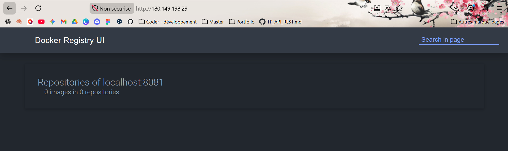

J'ai push mon image
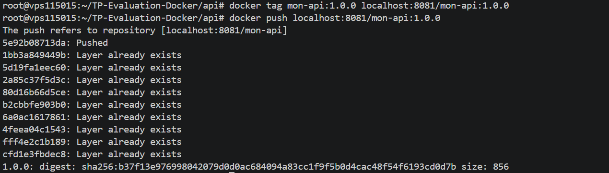

## Partie 3 - Partie 3 — Stack Compose & Nginx

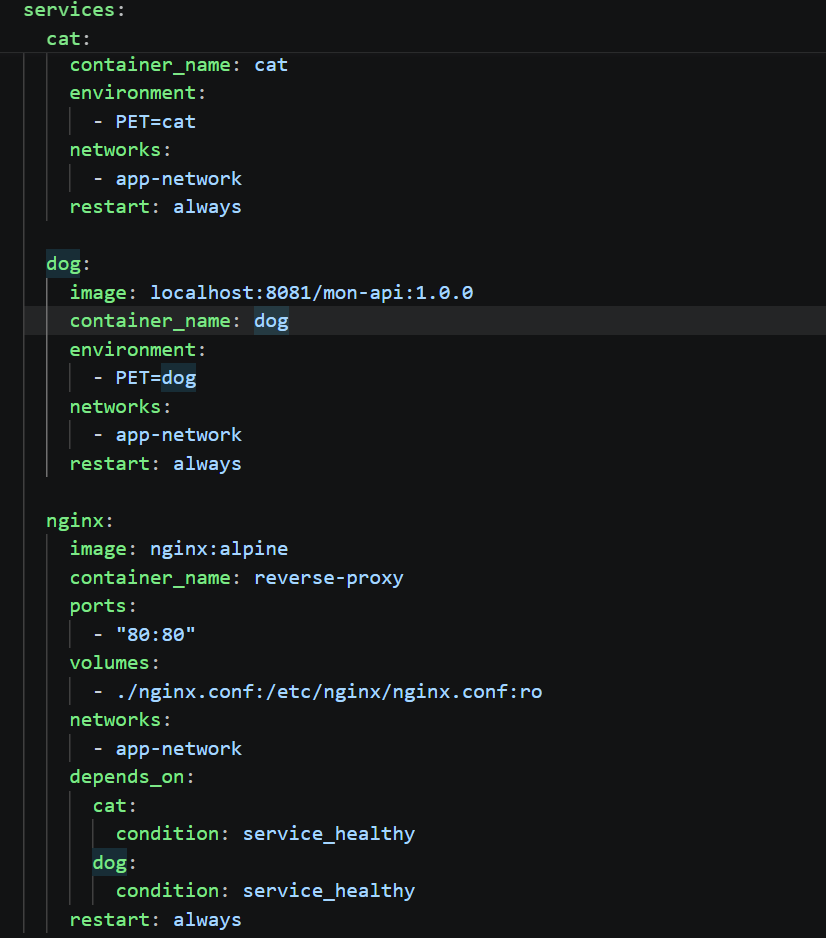
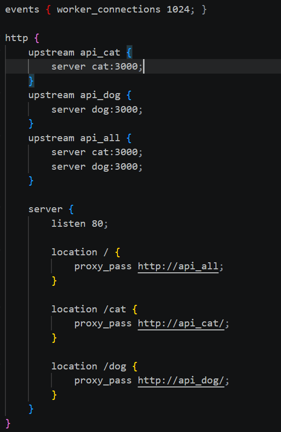

## Partie 4 — Sécurité

### pourquoi node:20-alpine plutôt que node:latest ? Quel est l'impact sur le nombre de CVE ?

node:20-alpine diminue le nombre de vulnérabilités détectées par Trivy car node:alpine se base sur une distribution minimaliste et ne contient seulement le strict nécessaire. Le code superflu n’est plus présent et réduit donc le nombre de vulnérabilité.

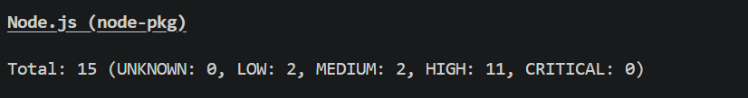

## Partie 5 — Validation de la stack

docker compose ps montre tous les services en état Up (healthy)

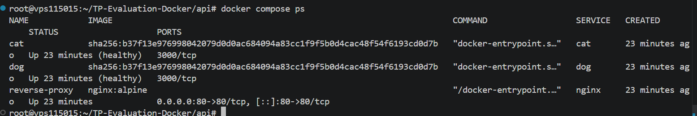

En rafraîchissant http://localhost/ plusieurs fois, les hostnames dans la réponse JSON alternent entre les deux conteneurs (deux appels successifs côte à côte)

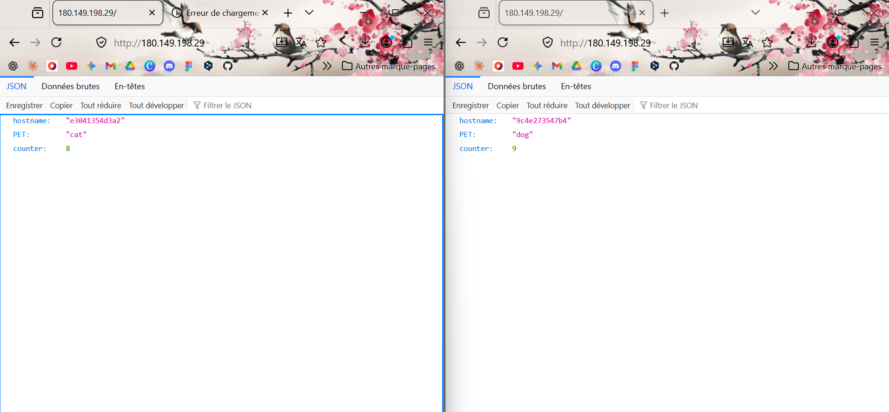

/cat répond avec PET: cat, /dog avec PET: dog, et les compteurs diffèrent entre les deux services

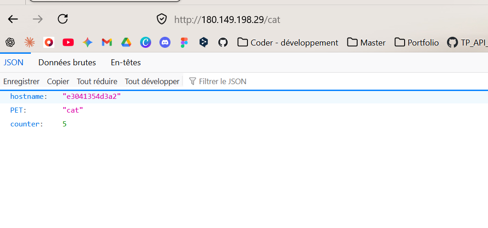
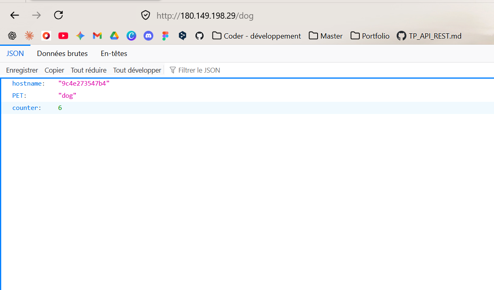

## Partie 6 — Questions théoriques

### Expliquez la différence entre docker compose up et docker stack deploy. Pourquoi la directive build: n'est-elle pas utilisable dans une stack déployée en mode Swarm ?

Docker compose up sert à lancer des conteneurs sur une seule machine. Tandis que docker stack deploy orchestre des services sur un cluster de serveurs.

La directive build n'est alors pas utilisable sur une stack déployée en SWARM car le cluster ne peut pas accéder à l'ensemble des contextes des machines et installée l'image simultanément.

### Expliquez la différence entre passer un mot de passe via une variable d'environnement et via un Docker Secret. Dans quel fichier le secret est-il accessible à l'intérieur du conteneur, et comment le lire depuis du code Node.js ?

Le secret est accessible à l'intérieur du conteneur lorsqu'il est dans une variable d'environnement. Les variables d'environnement sont moins sécurisées, elle sont visibles en clair dans les logs avec un docker inspect par exemple.
Un Docker Secret chiffre les données et elles ne sont jamais stockées en clair et sont exclusivement transmises aux conteneurs autorisés. 
Pour accéder à un secret depuis du code Node.js il suffit de réaliser ces lignes de code : 
const fs = require('fs');
const secret = fs.readFileSync('/run/secrets/mon_secret', 'utf8').trim();

### Dans une architecture Docker en production, quels éléments faut-il impérativement sauvegarder pour pouvoir reconstruire entièrement la stack après une panne ? Distinguez ce qui est recréable automatiquement de ce qui est irremplaçable.

Il faut impérativement sauvegarder les volumes de données, les fichiers d'environnement .env ou Secrets, ces élements sont irrémplacable.
Tandis que les images Docker, la configuration et les réseaux Docker sont recréable automatiquement. 

## Partie 7 — Observabilité & Production

Dashboard Grafana 

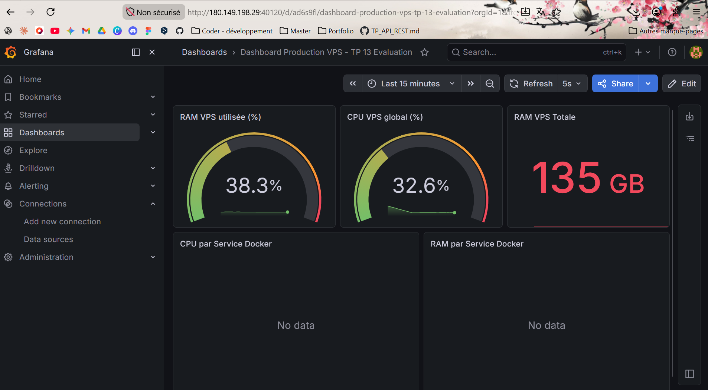

## Partie 8 — Volumes

Résultat du docker volume ls
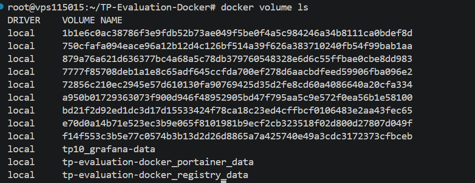

Résultat du docker volume inspect sur le volum tp-evaluatino-docker_registry_data
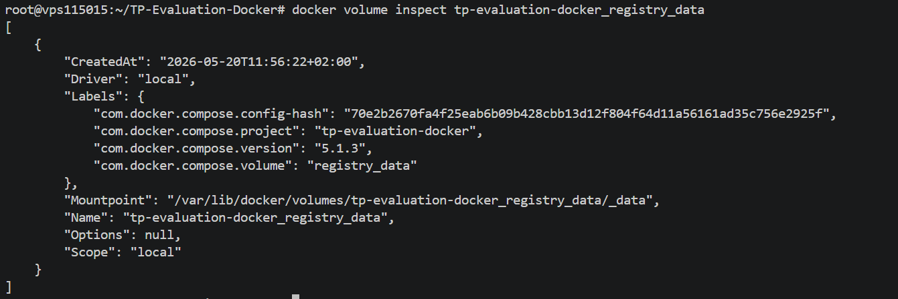

## Partie 9 — CI/CD avec GitHub Actions

Résultat du CI/CD GitHub Actions 
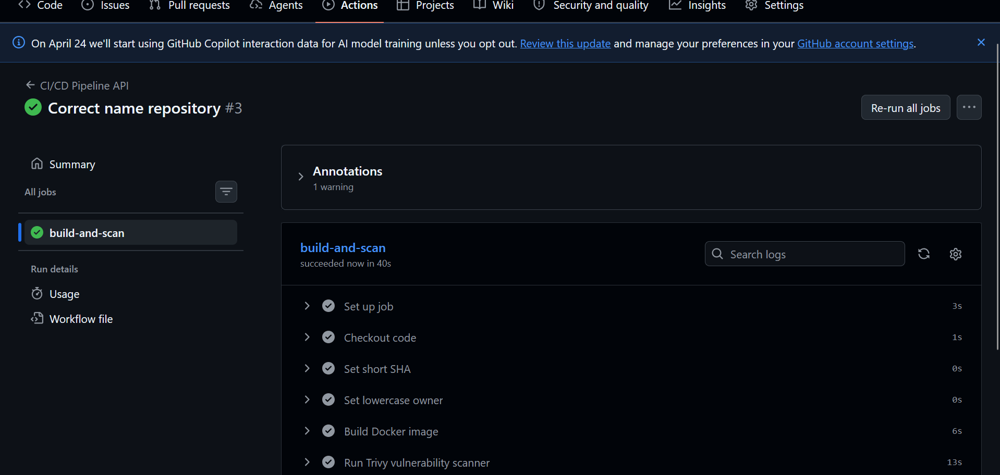

## Partie 10 — Déploiement sur VPS

URL de l'API : http://180.149.198.29:40110/ 
http://180.149.198.29:40110/cat
http://180.149.198.29:40110/dog

URL de Grafana : http://180.149.198.29:40120/ 
Accès de Grafana : admin admin

Je n'ai pas réussi à afficher le registry avec la version de l'image.

Résultat du docker compose ps 
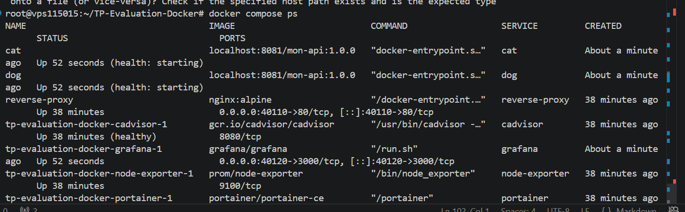

